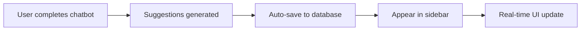

# 📋 Symptom History Sidebar Feature

## 🎯 Overview
The Symptom History Sidebar displays all final suggestions generated by the Symptom Helper Chatbot in a persistent, organized format. Users can view their complete conversation history with AI-powered health recommendations.

## ✨ Key Features

### 🔄 **Persistent Storage**
- **Automatic Saving**: All chatbot suggestions are automatically saved when conversations complete
- **Database Integration**: MongoDB storage with comprehensive metadata
- **User Association**: Suggestions linked to authenticated users
- **Session Tracking**: Each conversation maintains its own session ID

### 📊 **Rich Suggestion Display**
- **Urgency-Based Filtering**: Filter by High, Medium, Low, or All suggestions
- **Chronological Organization**: Most recent suggestions appear at the top
- **Expandable Cards**: Click to view detailed medical reasoning
- **Visual Urgency Indicators**: Color-coded cards with icons
- **Conversation Context**: Summary of what was discussed

### 📱 **Responsive Design**
- **Desktop**: Fixed sidebar with main content adjustment
- **Mobile**: Overlay sidebar with smooth animations
- **Touch-Friendly**: Optimized for mobile interactions
- **Adaptive Layout**: Seamlessly adjusts to screen size

## 🏗️ Technical Architecture

### **Backend Components**

#### **1. Data Model (`ChatbotSuggestion.js`)**
```javascript
{
  userId: ObjectId,              // User association
  sessionId: String,             // Unique conversation ID
  suggestions: [{                // Array of AI recommendations
    urgency: String,             // low/medium/high
    title: String,               // Recommendation title
    description: String,         // User-friendly explanation
    reasoning: String,           // Medical rationale
    action: String,              // Recommended next steps
    ruleId: String,             // Source rule identifier
    confidence: Number          // Confidence score (0-100)
  }],
  conversationSummary: String,   // Auto-generated summary
  userResponses: Map,            // User's answers to questions
  metadata: {                    // Session analytics
    sessionDuration: Number,     // Time spent (seconds)
    questionCount: Number,       // Questions answered
    manualMessageCount: Number   // Free-form messages sent
  },
  timestamps: Date              // Created/updated times
}
```

#### **2. API Endpoints**
- `POST /api/chatbot/suggestions` - Save conversation results
- `GET /api/chatbot/suggestions` - Retrieve user's history
- `DELETE /api/chatbot/suggestions/:id` - Remove specific suggestions

### **Frontend Components**

#### **1. Enhanced Chatbot (`SymptomChatbot.jsx`)**
- **Auto-Save Integration**: Saves suggestions when conversations complete
- **Conversation Analysis**: Generates intelligent summaries
- **Session Tracking**: Comprehensive metadata collection

#### **2. History Sidebar (`SymptomHistorySidebar.jsx`)**
- **Real-time Updates**: Automatic refresh every 30 seconds
- **Interactive Filtering**: Urgency-based organization
- **Expandable Details**: Toggle view for medical reasoning
- **Mobile Optimization**: Touch-friendly responsive design

#### **3. Dashboard Integration**
- **Sidebar Layout**: Fixed desktop position with mobile toggle
- **Responsive Grid**: Main content adjusts for sidebar space
- **Quick Access**: Prominent mobile toggle button

## 🎨 UI/UX Design

### **Visual Hierarchy**
```css
/* Color-coded urgency system */
High Priority:    Red gradients + pulse effects
Medium Priority:  Amber gradients + steady icons  
Low Priority:     Emerald gradients + check marks

/* Card Design */
- Gradient backgrounds for visual appeal
- Shadow effects for depth
- Smooth animations for interactions
- Clear typography hierarchy
```

### **Responsive Breakpoints**
```css
/* Mobile (< 1024px) */
- Overlay sidebar with backdrop
- Full-screen mobile experience
- Touch-optimized buttons

/* Desktop (≥ 1024px) */
- Fixed sidebar positioning
- Main content margin adjustment
- Hover effects and transitions
```

## 🔄 User Journey

### **1. Conversation Completion**


### **2. History Interaction**
1. **View Suggestions**: Recent suggestions appear automatically
2. **Filter Content**: Use urgency tabs to focus on specific types
3. **Expand Details**: Click to view medical reasoning and actions
4. **Manage History**: Delete unwanted suggestions
5. **Track Progress**: Monitor conversation patterns over time

## 📋 Example Data Flow

### **Conversation Completion**
```javascript
// 1. Chatbot generates suggestions
const suggestions = [
  {
    urgency: 'medium',
    title: 'Monitor for Dehydration',
    description: 'Vomiting and diarrhea can lead to dehydration.',
    reasoning: 'Loss of fluids requires attention to prevent complications.',
    action: 'Stay hydrated with small, frequent sips of clear fluids.'
  }
]

// 2. Auto-save with metadata
await api.post('/chatbot/suggestions', {
  sessionId: 'session_1234567890',
  suggestions,
  conversationSummary: 'Assessed 8 health questions. Reported: digestive symptoms.',
  userResponses: { digestive_check: ['nausea', 'vomiting'] },
  metadata: {
    sessionDuration: 180,      // 3 minutes
    questionCount: 8,          // 8 questions answered
    manualMessageCount: 2      // 2 free-form messages
  }
})

// 3. Sidebar automatically updates
// New suggestion appears at top with "Latest" badge
```

### **History Display**
```javascript
// Sidebar fetches and displays:
{
  createdAt: '2024-01-15T10:30:00Z',
  conversationSummary: 'Assessed 8 health questions...',
  suggestions: [/* array of recommendations */],
  highestUrgency: 'medium',
  suggestionCount: 3
}
```

## 🎯 Key Benefits

### **For Users**
- ✅ **Never Lose Recommendations**: All suggestions permanently stored
- ✅ **Track Health Patterns**: See trends in AI recommendations
- ✅ **Quick Reference**: Easy access to past medical guidance
- ✅ **Context Preservation**: Remember what was discussed
- ✅ **Mobile Accessibility**: Full functionality on any device

### **For Healthcare**
- ✅ **Continuity of Care**: Comprehensive recommendation history
- ✅ **Pattern Recognition**: Track recurring health concerns
- ✅ **Decision Support**: Review past AI assessments
- ✅ **Quality Assurance**: Audit conversation outcomes

## 🔧 Technical Specifications

### **Performance Features**
- **Efficient Queries**: MongoDB indexes for fast retrieval
- **Real-time Updates**: React Query with 30-second intervals
- **Lazy Loading**: Paginated results for large datasets
- **Optimized Rendering**: Virtual scrolling for long lists

### **Security & Privacy**
- **User Isolation**: Suggestions linked only to authenticated users
- **Secure API**: JWT-protected endpoints
- **Data Validation**: Input sanitization and validation
- **GDPR Compliance**: User data deletion capabilities

### **Scalability Design**
- **Database Indexes**: Optimized for user-based queries
- **API Pagination**: Handles large suggestion volumes
- **Component Modularity**: Reusable UI components
- **State Management**: Efficient React Query caching

## 🚀 Future Enhancements

### **Planned Features**
- **Export Options**: PDF/CSV export of suggestion history
- **Search Functionality**: Full-text search across suggestions
- **Tagging System**: User-defined categories for organization
- **Sharing Capabilities**: Share suggestions with healthcare providers
- **Analytics Dashboard**: Visual trends and pattern analysis

### **Integration Opportunities**
- **Calendar Integration**: Schedule follow-ups from suggestions
- **Reminder System**: Notifications for action items
- **Provider Portal**: Direct sharing with healthcare professionals
- **Wearable Data**: Integration with health monitoring devices

## 📊 Usage Analytics

### **Tracked Metrics**
- Suggestion view rates and engagement
- Filter usage patterns (urgency preferences)
- Session completion rates with saving
- Mobile vs desktop usage patterns
- Average suggestions per user

### **Success Indicators**
- High sidebar engagement rates
- Regular return visits to view history
- Positive user feedback on recommendation relevance
- Increased chatbot completion rates

---

## 🎉 **Result: Complete Symptom History Management**

The Symptom History Sidebar transforms the chatbot from a one-time interaction tool into a comprehensive health tracking platform. Users now have:

1. **Persistent Access** to all AI recommendations
2. **Organized History** with intelligent filtering
3. **Rich Context** including conversation summaries
4. **Mobile Excellence** with responsive design
5. **Professional Medical Feel** with urgency-based organization

**The feature successfully bridges the gap between AI-powered health assessment and long-term health management.** 🏥✨
